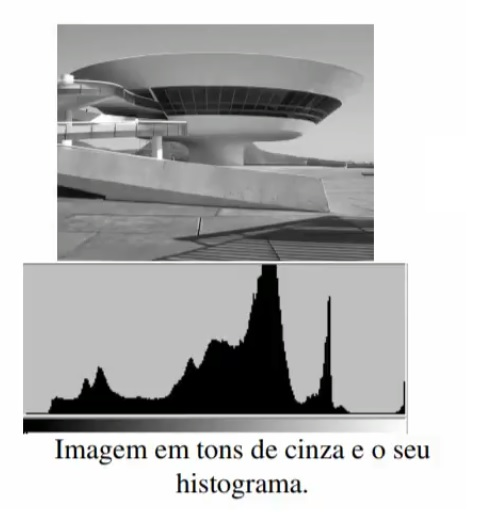
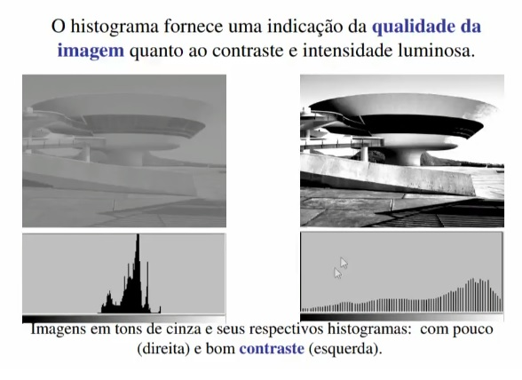

Histograma é uma tabela que mede para cada tom de cor o número de pixels que a imagem tem naquele tom.

Uma imágem com baixo contraste o histograma fica consentrado. Já em um imágem com alto contraste o histograma fica destribuido.

Histograma de Imagem Digital - Python e OpenCV 04a - https://www.youtube.com/watch?v=ioa_mFB_nFg&t=3s

Histograma de Imagem Digital - Python e OpenCV 04b - https://www.youtube.com/watch?v=83RZSK1j8Ak&t=411s